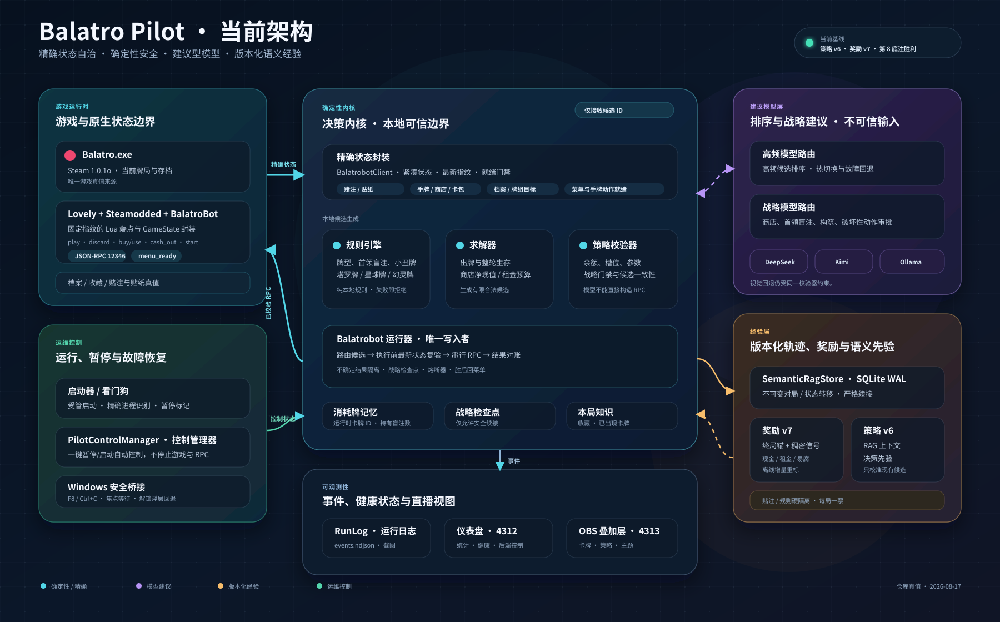

# Balatro Pilot

Balatro Pilot 是一个面向 Windows Steam 版《Balatro》的自动游玩与直播观测项目。它通过本机 BalatroBot JSON-RPC 读取精确游戏状态，在本地枚举合法动作，再将有限候选交给高频模型或战略模型排序。所有游戏写操作都经过本地合法性检查、状态版本校验和单写者队列。

> 本项目会自动操作游戏并持续写入本地运行日志。请先备份存档。API Key 不要写入 `config.json`，也不要提交到 Git。

## 核心特性

- 精确状态：BalatroBot Mod 提供手牌、Joker、商店、牌组、盲注和经济状态。
- 本地求解：规则引擎只生成合法的出牌、弃牌、购买、出售、重掷和卡包候选。
- 双模型边界：高频出牌 API 与战略 API 完全独立配置。
- 本地高频模式：可用 Ollama/Qwen 替代云端高频模型，并从 Dashboard 热切换。
- 战略审批：商店构筑、购买/出售/重掷、Boss 与关键盲注必须经过战略路由。
- 自学习：原始 transition 记录不覆写，奖励可离线重算；跨种子语义先验只校准现有合法候选，不绕过战略审批。
- 直播组件：Dashboard、牌组 Overlay、中文策略 Overlay，以及无需付费请求的组件 Health Check。
- 安全执行：F8/Ctrl+C 急停、RPC 后对账、超时不盲目重放、失焦等待。

## 架构



架构以“游戏真值、确定性决策内核、模型建议、版本化经验、运维观测”五个边界组织。模型只能选择本地合法候选，Runner 是唯一游戏写者，Reward v7 与 Semantic Prior 只能校准候选排序。

详见 [系统架构](docs/architecture.md) 与 [Reward v7 奖励机制](docs/reward-v7.md)。

模型供应商协议、密钥映射、路由构建与动态切换代码集中在 [`src/models`](src/models)：

- `model-routing.mjs`：公开的模型配置与 Provider→凭据映射。
- `model-stack.mjs`：唯一的模型实例构建入口。
- `planner.mjs`：HTTP 协议、提示词与 JSON 恢复。
- `routine-router.mjs`：本地/高频云端热切换与故障回退。
- `strategic-router.mjs`：战略模型热切换。

旧模块路径保留为兼容导出，现有集成不需要立即迁移。

## 环境要求

- Windows 10/11；
- Steam 版 Balatro 1.0.1o；
- PowerShell 5.1；
- Node.js 24 或更高；
- 联网安装 Mod 栈和访问所选模型 API；
- 可选：Ollama 与约 6.6 GB 的本地模型下载，运行时通常占用约 6–7 GB 显存。

项目没有第三方 npm 依赖，不需要执行 `npm install`。

## 五分钟启动

### 1. 准备配置

```powershell
Copy-Item .\config.example.json .\config.json
```

新配置只需要理解两条云端路由：

```json
{
  "modelRoutes": {
    "routine": {
      "provider": "deepseek-chat",
      "model": "deepseek-v4-flash",
      "baseUrl": "https://api.deepseek.com",
      "reasoningEffort": "none",
      "timeoutMs": 90000
    },
    "strategic": {
      "provider": "kimi-chat",
      "model": "k3-256k",
      "baseUrl": "https://api.kimi.com/coding/v1",
      "reasoningEffort": "medium",
      "timeoutMs": 300000
    }
  }
}
```

- `routine`：高频出牌、弃牌和常规候选排序。
- `strategic`：商店构筑、购买/出售/重掷、Boss、关键盲注和转型。
- `local`：可选的本地高频模型。
- `vision`：旧视觉控制器的兼容回退；默认可复用战略供应商。

高频路由支持 `deepseek-chat`、`kimi-chat`、`kimi-platform` 和 `openai-responses`；战略路由支持 Kimi 与 DeepSeek，`local` 专用于 `ollama-chat`。在 `auto`/`vision` 模式下，视觉回退必须与战略路由使用同一个供应商与“战略 API Key”。旧的 `balatrobotProvider`、`balatrobotStrategicProvider` 等字段仍可读取，新字段优先。

### 2. 保存两把 API Key

```powershell
powershell -NoProfile -ExecutionPolicy Bypass -File .\scripts\store-model-keys.ps1
```

脚本会分别提示输入：

1. 高频出牌 API Key；
2. 战略 API Key。

密钥使用当前 Windows 用户的 DPAPI 加密，默认保存到：

- `%LOCALAPPDATA%\BalatroPilot\routine-api-key.dpapi`
- `%LOCALAPPDATA%\BalatroPilot\strategic-api-key.dpapi`

只更新其中一把：

```powershell
.\scripts\store-model-keys.ps1 -RoutineOnly
.\scripts\store-model-keys.ps1 -StrategicOnly
```

也可在当前进程直接设置 `BALATRO_ROUTINE_API_KEY` 与 `BALATRO_STRATEGY_API_KEY`；它们优先于 DPAPI 文件。供应商原生变量 `DEEPSEEK_API_KEY`、`KIMI_API_KEY`、`MOONSHOT_API_KEY` 或 `OPENAI_API_KEY` 作为兼容回退。使用同一供应商但不同 Key 时，必须使用前两个角色变量或两份 DPAPI 文件。

### 3. 安装固定 Mod 栈

先完全退出 Balatro，再执行：

```powershell
powershell -NoProfile -ExecutionPolicy Bypass -File .\scripts\install-balatrobot.ps1
```

安装器固定并校验：

- Lovely 0.9.0；
- Steamodded 1.0.0-beta-1814a；
- BalatroBot 1.5.2（固定 commit）；
- uv 0.12.3；
- Balatro Pilot 的随机种子、Endless、结算与 cash-out 安全补丁。

默认安装到 `%APPDATA%\Balatro\Mods`。有冲突时安装器会拒绝覆盖；确认后使用 `-Force`，原目标会先备份。

### 4. 可选安装本地高频模型

```powershell
powershell -NoProfile -ExecutionPolicy Bypass -File .\scripts\install-local-model.ps1
```

不安装也可以运行，Dashboard 中将高频后端切换为云端即可。

### 5. 一键运行

先启动 Balatro，然后：

```powershell
powershell -NoProfile -ExecutionPolicy Bypass -File .\scripts\run-balatro-pilot.ps1
```

该脚本会按需启动 Dashboard、Overlay、BalatroBot、Ollama 和控制器。运行期间按 F8 或在终端按 Ctrl+C 停止控制器。

## 验证与诊断

```powershell
npm run bot-doctor
powershell -NoProfile -ExecutionPolicy Bypass -File .\scripts\run-balatro-pilot.ps1 -ApiDoctor
powershell -NoProfile -ExecutionPolicy Bypass -File .\scripts\run-balatro-pilot.ps1 -StrategicApiDoctor
powershell -NoProfile -ExecutionPolicy Bypass -File .\scripts\run-balatro-pilot.ps1 -DryRun
```

- `bot-doctor`：检查本机 Mod/RPC，不调用付费模型。
- `ApiDoctor`：对高频路由发送一个很短的付费文本请求。
- `StrategicApiDoctor`：对战略路由发送一个很短的付费文本请求。
- `DryRun`：读取真实状态并规划一次，但不发送游戏写操作。

旧视觉控制器诊断：

```powershell
npm run doctor
npm run screenshot
```

## Dashboard 与 OBS

- Dashboard：<http://127.0.0.1:4312>
- 组件状态：<http://127.0.0.1:4312/api/components>
- Dashboard 健康：<http://127.0.0.1:4312/api/health>
- 当前牌组 Overlay：<http://127.0.0.1:4313/overlay/cards>
- 中文策略 Overlay：<http://127.0.0.1:4313/overlay/strategy>

Health Check 只检查本地进程、端口、文件和本地服务，不会为了健康检查调用付费模型。Dashboard 可以实时切换本地/高频云端，以及 Kimi/DeepSeek 战略路由。

OBS 推荐把游戏、牌组 Overlay 和策略 Overlay 分别作为三个源拼接，浏览器源保持透明背景。布局可按直播画布缩放；当前页面会自动裁切和换行。

## 自学习数据

学习数据库默认位于 `data/semantic-experience.sqlite`。这不是修改模型权重的训练，而是“记录轨迹 → 离线重算奖励 → 按抽象局面聚合 → 校准当前合法候选”的安全经验学习。

当前实现为 Semantic Policy v6 / Reward v7；完整公式、终局锚点、迁移和先验消费规则见 [Reward v7 奖励机制](docs/reward-v7.md)。

- 原始 transition 与奖励标签分层保存。调整奖励公式时只生成新标签，不覆盖旧 transition，因此 v1–v5 的兼容历史都能继续使用；episode 元数据可在严格确认同一局续接时更新。
- 失败局统一提供负面证据，不会再因为局中推进奖励而被误标成成功经验；高分和后期失败仍在负面样本内部保留质量排序。
- 决策按阶段、Boss、经济压力、构筑角色、手牌形状和语义动作聚合，不包含随机 seed 或精确牌序。每局最多一票，至少 3 个独立 episode 且置信区间足够明确时才影响排序。
- 经验混合权重默认最多 30%，只能重排本地已经生成的候选；它不能发明动作、绕过本地 validator，也不能替商店购买/出售/重掷跳过战略模型审批。
- 精确状态自动重放默认关闭。控制器重启后会保守续接同一局；历史中可可靠证明连续的中断段也会在奖励层关联到最终结果，原始记录保持不变。

只有 RPC 前后状态明确变化的动作才会进入原始轨迹。以下内容不会成为有效经验：

- dry-run；
- RPC 拒绝；
- 超时后无法确认；
- 陈旧计划；
- 无法可靠关联到后续终局的中断段。

查看统计：

```powershell
npm run memory
npm run learning:report
```

`learning:report` 会只读输出历史覆盖率、奖励完整性、抽象决策桶支持度、经验先验可应用度和实际影响率，不会启动游戏或调用付费模型。还可以生成固定 seed/deck 的成对、反平衡 A/B 评测清单：

```powershell
npm run learning:report -- --seeds SEED_A,SEED_B --decks RED,BLUE --repeats 2 --output learning-report.json
```

该命令只生成评测计划；不会自行重放固定 seed，也不会修改游戏存档。

`data/`、`runs/`、`config.json` 和密钥都被 Git 忽略。换机器时可选择单独备份数据库；删除数据库会从空经验重新训练，不影响代码运行。

## Mod 发布包

仓库内不捆绑 Lovely 或 Steamodded 二进制。它们由安装器从固定官方版本下载并校验，避免混入用户 Mod 和履行不清晰的第三方分发义务。

在固定安装器验证过运行时后，可生成仅含 patched BalatroBot 的分发包。包内运行时代码由固定指纹保证一致；ZIP 容器时间戳可能随构建时间变化，因此每次同时生成对应 SHA-256：

```powershell
npm run package:mod
```

产物：

- `release/balatrobot-pilot-v1.5.2.zip`
- `release/balatrobot-pilot-v1.5.2.zip.sha256`

ZIP 顶层为 `balatrobot/`，包含上游 MIT 许可证和版本来源说明，不包含存档、日志、API Key、Lovely 或 Steamodded。

上游 BalatroBot `v1.5.2` 固定提交中的 `balatrobot.json` 仍标记 `1.5.1`，这是上游元数据滞后；本项目以提交号、安装标记和完整运行时指纹核验实际版本。

## 常见问题

### BalatroBot 指纹不匹配

完全退出游戏，重新运行 `install-balatrobot.ps1`。不要同时安装两套 Lovely、Steamodded 或 BalatroBot。

### API 401/403

确认路由 Provider 与对应 Key 属于同一平台，重新运行 `store-model-keys.ps1`。不要把 Kimi Code Key 填到 Moonshot 开放平台地址，反之亦然。

### API 很慢但仍在生成

战略路由默认允许最长 300 秒。控制器不会在 40 秒强制中断，也不会因为等待而盲目重放动作。高频路由应选择低延迟模型或本地 Ollama。

### 本地模型不可用或显存不足

在 Dashboard 切换到云端高频后端；本地模型会卸载并释放显存。直播使用 CPU 编码可减少 GPU 编码占用，但模型显存仍需单独预留。

### Dashboard Health 一直检查

先访问 `/api/health` 和 `/api/components`。新版探针使用轻量端口扫描、请求超时、single-flight 和上次成功快照，不会因为一次 PowerShell 探针超时就误报全部离线。旧标签页可按 Ctrl+F5。

### 游戏或控制器停止

检查：

- `runs/*/events.ndjson`
- `runs/web-services/*.stderr.log`
- `%APPDATA%\Balatro\Mods\lovely\log\`
- `%LOCALAPPDATA%\BalatroPilot\`

不要在未定位根因时循环重启。

## 测试与发布

```powershell
npm test
npm run check
```

提交前确认：

```powershell
git status --short
git diff --cached
```

仓库必须只包含源码、文档、固定补丁和测试。不得强制添加 `config.json`、`runs/`、`data/`、`.env` 或 `*.dpapi`。

## 许可证

Balatro Pilot 使用 [MIT License](LICENSE)。第三方组件保持各自许可证；生成的 BalatroBot 包内附上游 MIT 许可证。Lovely 与 Steamodded 不包含在本仓库生成的 Mod ZIP 中。
