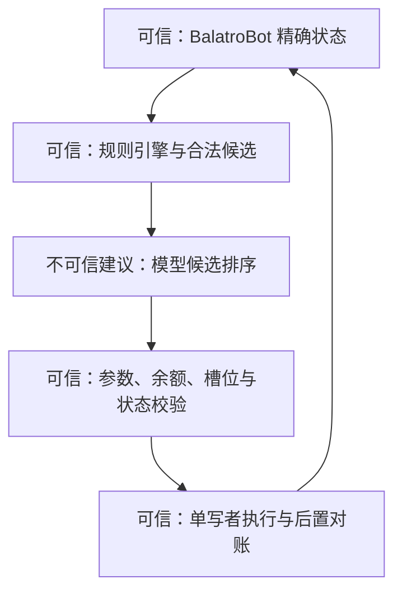

# Balatro Pilot 架构

本文是 README 架构图的文字说明，用于维护者定位职责边界。

## 数据流

1. BalatroBot Mod 通过本机 JSON-RPC 暴露精确状态。
2. `balatrobot-policy.mjs`、`balatrobot-solver.mjs` 和规则引擎枚举合法候选。
3. `src/models/model-stack.mjs` 构造高频、本地、战略和视觉路由。
4. 模型只能选择本地候选 ID；关键构筑动作需要战略审批。
5. runner 在执行前比较状态版本，单写者发送一个 RPC，再读取新状态对账。
6. 已确认转移写入事件日志，并供学习、Dashboard 和 OBS 使用。

## 信任边界

模型输出永远不是直接 RPC 参数来源。高频路径只返回候选 ID；战略路径同样必须落在本地合法候选集合内。

## 模型边界

| 路由 | 职责 | 凭据 |
| --- | --- | --- |
| `routine` | 高频出牌、弃牌和常规排序 | 高频出牌 API Key |
| `strategic` | 构筑、商店、Boss 和关键盲注 | 战略 API Key |
| `local` | 本机高频排序 | 无 |
| `vision` | 旧视觉控制兼容回退 | 默认复用战略供应商 |

供应商协议和密钥不应出现在游戏策略、规则求解或 RPC 执行模块中。

## 端口

| 端口 | 服务 |
| --- | --- |
| 12346 | BalatroBot JSON-RPC |
| 11434 | Ollama |
| 4312 | Dashboard / Health |
| 4313 | OBS Overlay |
